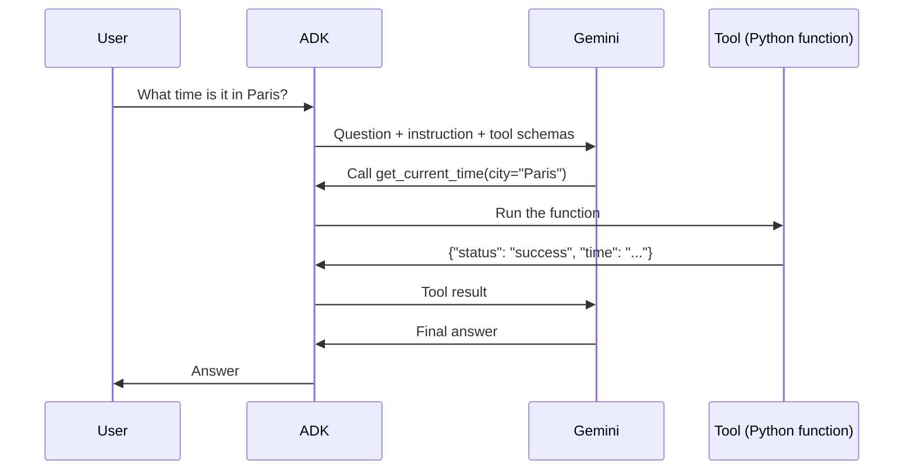
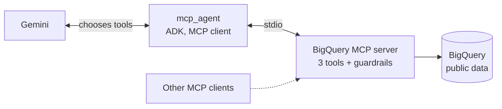

# gcp-agents-lab

Hands-on lab for building AI agents on Google Cloud with the [Agent Development Kit (ADK)](https://adk.dev), from a first local agent to a deployment on Agent Runtime and Gemini Enterprise.

Each phase adds one concept and is tagged in Git, so the history shows the progression step by step.

## Roadmap

| Phase | What it adds | Status | Tag |
|---|---|---|---|
| 0. Setup | uv project, ADK, gcloud, API key | ✅ Done | |
| 1. Local agent | First ADK agent with a mock tool, run locally | ✅ Done | `v0.1-local-agent` |
| 2. Real tool | Agent answers questions on BigQuery public data with ADK's built-in toolset | ✅ Done | `v0.2-bigquery` |
| 3. MCP server | Custom MCP server exposing BigQuery tools with cost guardrails, consumed by an ADK agent | ✅ Done | `v0.3-mcp` |
| 4. Deployment | Agent deployed to Agent Runtime (Vertex AI) | 🚧 In progress | |
| 5. Gemini Enterprise | Agent registered and used in Gemini Enterprise | Planned | |

## How an agent works here

The model decides, ADK executes. Gemini never runs the Python code itself: it asks for a tool call, ADK runs the function locally and sends the result back.




## Phase 3: a custom BigQuery MCP server

The BigQuery tools live in a separate program, [`mcp_agent/bigquery_mcp_server.py`](mcp_agent/bigquery_mcp_server.py), that speaks the [Model Context Protocol](https://modelcontextprotocol.io). Any MCP client can use it: the ADK agent `mcp_agent`, but also Claude Code, Gemini CLI or the MCP Inspector. The agent starts the server as a subprocess and talks to it over stdio.



**Tools exposed:** `list_tables`, `get_table_schema`, `run_query`.

**Guardrails, enforced by the server whatever the client or the prompt:**
- Every query is first validated with a BigQuery **dry run**, which estimates the bytes scanned without running or billing anything.
- Only `SELECT` statements are accepted.
- Queries that would scan more than **1 GB** are refused; `maximum_bytes_billed` adds a second, server-side cap.
- At most 100 rows are returned to the model.
- Errors (refusals, invalid SQL, unknown tables) are returned as messages rather than raised, so the model can read them and fix its query.

### Test results

| Question | What the agent did | Result |
|---|---|---|
| Top 5 female names in Texas in 2000 | Read the schema, then wrote `SELECT name, number ... WHERE state = 'TX' AND year = 2000 AND gender = 'F' ORDER BY number DESC LIMIT 5` | ✅ Correct answer, only the needed columns scanned |
| List the columns of `github_repos.commits` | Used `get_table_schema` (metadata only) | ✅ Answered without scanning any data |
| `SELECT * FROM github_repos.commits LIMIT 10` | Called `run_query` | 🛑 Refused by the dry run: **910.6 GB** estimated. `LIMIT` does not reduce the bytes BigQuery scans. The agent explained the refusal and suggested selecting fewer columns. |


## Repository structure

```
gcp-agents-lab/
├── pyproject.toml              # Project manifest (Python version, dependencies)
├── uv.lock                     # Exact versions of every package, for reproducibility
├── my_agent/                   # Phase 1: first agent, mock tool
├── bq_agent/                   # Phase 2: ADK's built-in BigQueryToolset
├── mcp_agent/                  # Phase 3: MCP client agent
│   ├── agent.py                # Starts the MCP server and uses its tools
│   ├── bigquery_mcp_server.py  # The MCP server, kept in the agent folder so it is deployed with it
│   └── .env.example            # Configuration template (the real .env is never committed)
├── scripts/
│   └── test_mcp_server.py      # Tests the MCP server alone, without ADK or Gemini
└── docs/
    ├── decisions.md            # Why each technical choice was made
    └── images/
```

Each agent has its own folder at the root. `adk web` lists every agent folder it finds.

## Quick start

Prerequisites: [uv](https://docs.astral.sh/uv/), a Gemini API key from [Google AI Studio](https://aistudio.google.com), and for phases 2 and 3 the [Google Cloud CLI](https://cloud.google.com/sdk/docs/install) with a project where the BigQuery API is enabled.

```bash
git clone https://github.com/<your-username>/gcp-agents-lab.git
cd gcp-agents-lab
uv sync                                          # Creates .venv and installs locked dependencies

# Phase 1 only needs the API key
cp my_agent/.env.example my_agent/.env           # Then fill in my_agent/.env

# Phases 2 and 3 also need Google Cloud credentials and a billing project
gcloud auth application-default login
cp mcp_agent/.env.example mcp_agent/.env         # Then fill in the API key and GOOGLE_CLOUD_PROJECT

uv run adk web --port 8000                       # Open http://localhost:8000
```

To test the MCP server alone:

```bash
set -a; source mcp_agent/.env; set +a            # Loads GOOGLE_CLOUD_PROJECT
uv run python scripts/test_mcp_server.py         # Lists the tools and calls list_tables
```

On Windows, if `adk web` raises a `NotImplementedError`, add `--no-reload`.

## Agents

| Agent | Description | Model | Tools |
|---|---|---|---|
| `my_agent` | Tells the time in a city (mock data, to learn the tool-call loop) | `gemini-3.5-flash-lite` | `get_current_time` |
| `bq_agent` | Answers questions on BigQuery public data | `gemini-3.5-flash-lite` | ADK `BigQueryToolset`, write operations blocked |
| `mcp_agent` | Same questions, through the custom MCP server | `gemini-3.5-flash-lite` | `list_tables`, `get_table_schema`, `run_query` (via MCP) |

## Documentation

- [Technical decisions](docs/decisions.md): the choices made in this project and why.