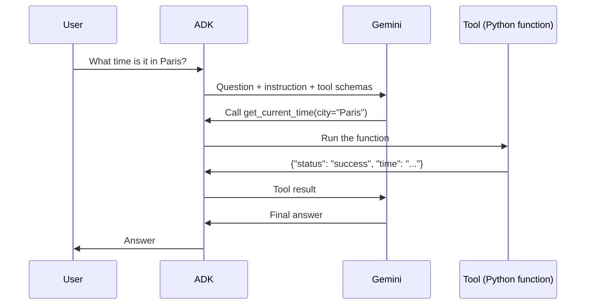

# gcp-agents-lab

Hands-on lab for building AI agents on Google Cloud with the [Agent Development Kit (ADK)](https://adk.dev), from a first local agent to a deployment on Agent Runtime and Gemini Enterprise.

Each phase adds one concept and is tagged in Git, so the history shows the progression step by step.

## Roadmap

| Phase | What it adds | Status | Tag |
|---|---|---|---|
| 0. Setup | uv project, ADK, gcloud, API key | ✅ Done | |
| 1. Local agent | First ADK agent with a mock tool, run locally | ✅ Done | `v0.1-local-agent` |
| 2. Real tool | Agent answers questions on a BigQuery public dataset | ⏳ Next | |
| 3. MCP integration | Same data, reached through an MCP server | Planned | |
| 4. Deployment | Agent deployed to Agent Runtime (Vertex AI) | Planned | |
| 5. Gemini Enterprise | Agent registered and used in Gemini Enterprise | Planned | |

## How an agent works here

The model decides, ADK executes. Gemini never runs the Python code itself: it asks for a tool call, ADK runs the function locally and sends the result back.




## Repository structure

```
gcp-agents-lab/
├── pyproject.toml      # Project manifest (Python version, dependencies)
├── uv.lock             # Exact versions of every package, for reproducibility
├── my_agent/           # Phase 1 agent
│   ├── __init__.py     # Makes the folder a package so ADK can find root_agent
│   ├── agent.py        # Agent definition: model, instruction, tools
│   └── .env.example    # Configuration template (the real .env is never committed)
└── docs/
    ├── decisions.md    # Why each technical choice was made
    └── images/
```

Each new agent gets its own folder at the root. `adk web` lists every agent folder it finds.

## Quick start

Prerequisites: [uv](https://docs.astral.sh/uv/) and a Gemini API key from [Google AI Studio](https://aistudio.google.com).

```bash
git clone https://github.com/<your-username>/gcp-agents-lab.git
cd gcp-agents-lab
uv sync                                      # Creates .venv and installs locked dependencies
cp my_agent/.env.example my_agent/.env       # Then put your API key in my_agent/.env
uv run adk web --port 8000                   # Open http://localhost:8000
```

To chat in the terminal instead: `uv run adk run my_agent`.

## Agents

| Agent | Description | Model | Tools |
|---|---|---|---|
| `my_agent` | Tells the time in a city (mock data, to learn the tool-call loop) | `gemini-3.5-flash-lite` | `get_current_time` |

## Documentation

- [Technical decisions](docs/decisions.md): the choices made in this project and why.